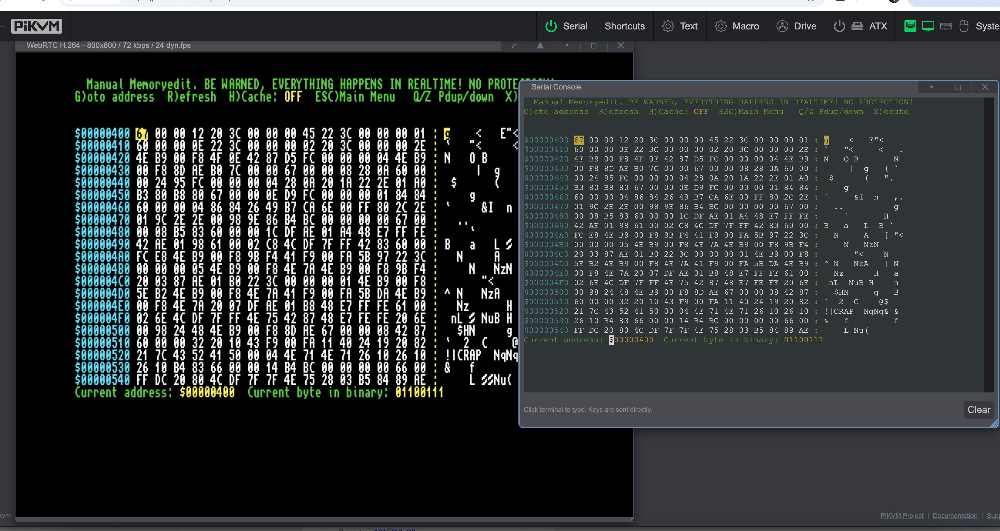

# kvmd-serial

Serial console plugin for [PiKVM](https://pikvm.org). Adds a fully interactive serial port terminal to the PiKVM web UI with ANSI escape code support via [xterm.js](https://xtermjs.org/).



## Features

- Real-time serial port I/O streamed over WebSocket
- Full ANSI terminal emulation (colors, cursor positioning, etc.)
- Interactive - keystrokes sent directly, no line buffering
- Baud rate selectable from the UI (1200 - 115200)
- Paste support
- Resizable terminal window
- LED indicator showing connection status

## Install

### Quick install (SSH)

```bash
ssh root@<pikvm-ip>
rw
cd /tmp
curl -sSL https://github.com/terriblefire/kvmd-serial/releases/latest/download/kvmd-serial-1.0.0.tar.gz | tar xz
bash kvmd-serial-1.0.0/install.sh
```

### Arch package

```bash
scp kvmd-serial-1.0.0-1-any.pkg.tar.xz root@<pikvm-ip>:/tmp/
ssh root@<pikvm-ip>
rw
pacman -U /tmp/kvmd-serial-1.0.0-1-any.pkg.tar.xz
python3 /usr/share/kvmd-serial/patch.py
systemctl restart kvmd
```

Then add to `/etc/kvmd/override.yaml`:

```yaml
kvmd:
    serial:
        type: tty
        device: /dev/ttyUSB0
        speed: 9600
```

And restart: `systemctl restart kvmd`

The install script does this automatically.

## Configuration

The default device is `/dev/ttyUSB0` at 9600 baud. Change in `/etc/kvmd/override.yaml`:

```yaml
kvmd:
    serial:
        type: tty
        device: /dev/ttyAMA0    # or any serial device
        speed: 9600             # default baud rate
```

The baud rate can also be changed live from the web UI dropdown.

## Uninstall

```bash
ssh root@<pikvm-ip>
rw
bash /tmp/kvmd-serial-1.0.0/uninstall.sh
```

Or if installed via pacman:

```bash
pacman -R kvmd-serial
systemctl restart kvmd
```

## Compatibility

Tested on kvmd 4.163+ with PiKVM v4.

## License

GPL-3.0 - same as [kvmd](https://github.com/pikvm/kvmd).
